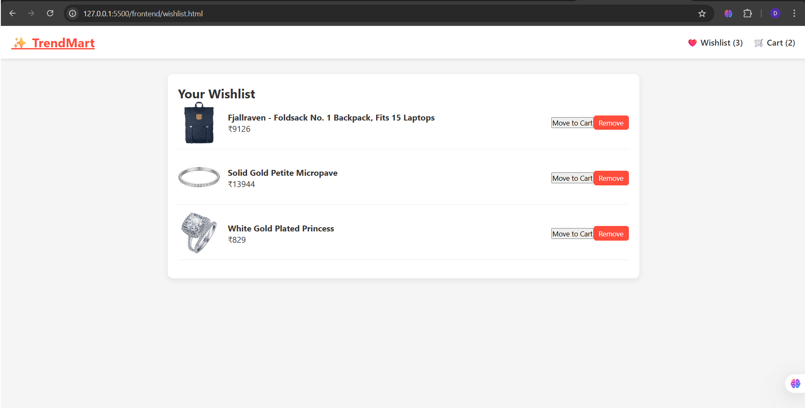

TrendMaker - E-Commerce Frontend Application

TrendMaker is a responsive e-commerce frontend website built using HTML, CSS, and JavaScript. It allows users to browse products, add them to a cart or wishlist, and proceed with a checkout process. The project reflects practical frontend skills and focuses on delivering a clean and responsive user experience.

The application includes:

A modern home page with product listings

Product details for better shopping decisions

A shopping cart to add, update, or remove products

Wishlist functionality for saving favorites

A checkout page with order confirmation

## Screenshots

### Home Page

### Product Page

### Cart Page

### Wishlist

### Checkout

### order confirmed

The frontend is designed using HTML for structure, CSS for styling and responsive layouts, and JavaScript for interactivity. Git and GitHub are used for version control and collaboration.

The project folder contains the frontend code and a screenshots folder that demonstrates different pages of the application. Screenshots are provided for Home Page, Product Page, Cart Page, Wishlist Page, and Checkout Page.

To use the project, simply open the index.html file from the frontend folder in any modern browser. No additional setup is required.

Setup and Usage
Clone the repository:

git clone https://github.com/deepthi-mallarapu/TrendMaker_Ecommerce_Application.git

Open the project folder in VS Code or any editor.

Open index.html in a browser to explore the website.

Future improvements can include backend integration, user authentication, database connectivity, and payment gateway support to create a complete e-commerce platform.

Developed by Deepthi Mallarapu.
